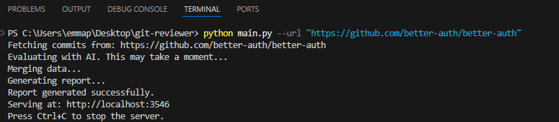
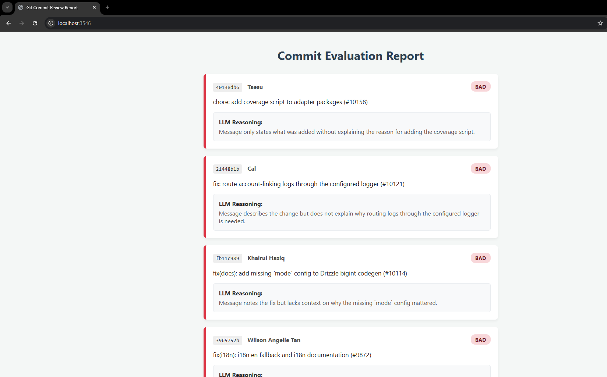

# Git Commit Reviewer

## Overview
Git Commit Reviewer is a terminal-based application designed to evaluate the quality of git commit messages using a Large Language Model (LLM). It connects to the OpenRouter API (utilizing the `gpt-oss-120b:free` model) to analyze recent commits, assessing whether they provide descriptive clarity and explain the "why" behind the code changes.

The application generates a structured, color-coded HTML report and serves it locally, providing developers with immediate, readable feedback on their version control practices.

## Technical Highlights
* **Native Subprocess Integration**: Bypasses heavy third-party git libraries (like GitPython) to avoid Windows recursion limits and memory overhead. It utilizes native OS subprocesses for secure, shallow-cloned repository parsing.
* **Strict JSON Enforcement**: Employs defensive programming and targeted prompt engineering to force the LLM to return strictly formatted JSON arrays, including markdown stripping fallbacks.
* **Secure Secret Management**: Utilizes `python-dotenv` to ensure API keys remain out of the source code and version history.
* **Zero-Dependency Web Server**: Serves the generated HTML report locally using Python's built-in `http.server` and `socketserver`, avoiding the need for bulky web frameworks.

## Installation

Ensure you have Python 3.8+ installed on your system. It is recommended to use a virtual environment.

1. Clone the repository and navigate to the project directory:
   ```bash
   git clone https://github.com/EyitoCODE/Git-commit-reviewer.git
   cd git-reviewer


2. Install the required dependencies:
```bash
pip install -r requirements.txt

```


## Configuration

The application requires an OpenRouter API key to function.

1. Create a file named `.env` in the root directory of the project.
2. Add your API key to the file in the following format:
```text
OPENROUTER_API_KEY="your_actual_api_key_here"

```


## Usage

You can run the application against a local repository or any public remote repository URL. The application will fetch the 10 most recent commits, evaluate them, and spin up a local server.

**Run against a locally opened repository:**

```bash
python main.py

```

**Run against a remote repository URL:**

```bash
python main.py --url "https://github.com/better-auth/better-auth"

```

### Execution Example

**


### The Generated Report

Once the execution is complete, navigate to `http://localhost:3546` in your web browser to view the dynamic evaluation report.

**

